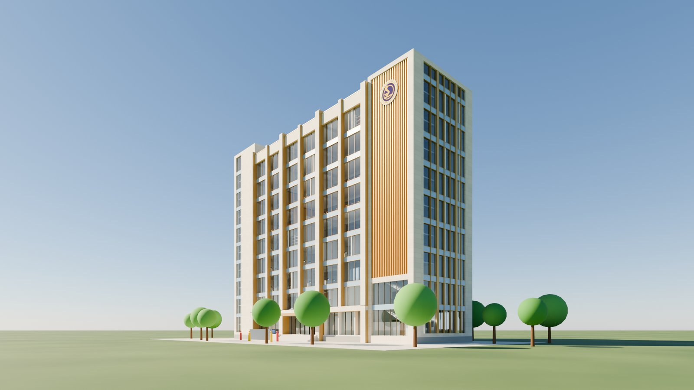
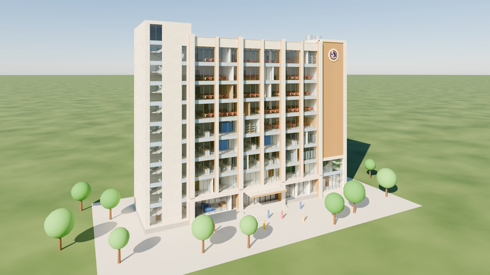

# Mô hình 3D – Giảng đường A1-2B

Mô hình 3D tương tác của **Giảng đường A1-2B (9 tầng)** – Phân hiệu Trường Đại học Giao thông Vận tải tại TP. Hồ Chí Minh (UTC2), dựng lại từ hồ sơ **thiết kế sơ bộ** (bản vẽ kiến trúc `KT A1-2B GTVT.pdf`).

**Xem trực tiếp:** https://kien14593-lab.github.io/giang-duong-a1-2b-3d/

| Phiên bản | Địa chỉ | Ghi chú |
|---|---|---|
| **Bản gốc + Phương án đề xuất + Báo cáo V3** (chuyển đổi trong trang, mục *Phương án*) | https://kien14593-lab.github.io/giang-duong-a1-2b-3d/ | Bản hiện hành, có đủ công cụ (nắng, đo, lớp phủ, xuất, phối cảnh đẹp, chụp ảnh 4K) |
| **Bản lưu mô hình gốc** (đóng băng, trước khi cập nhật) | https://kien14593-lab.github.io/giang-duong-a1-2b-3d/goc/ | Mã nguồn tại thư mục `goc/`, tương ứng tag `v1-ban-ve-goc` |

## Nội dung mô hình

- Toàn bộ 9 tầng + tầng mái (tum kỹ thuật, tháp thang, khung pergola, bồn nước, cục nóng điều hòa) và sân trước (bậc cấp, ram dốc, cây xanh, người tỉ lệ).
- Từng tầng: sàn, dầm, cột theo lưới trục, các phòng theo bản vẽ mặt bằng (phòng học, hội trường, làm việc, họp, kỹ thuật, vệ sinh, giao thông), tường ngăn, cửa, đồ nội thất minh họa, 2 lõi thang bộ dạng chữ U, 2 thang máy.
- **Hội trường tầng 1–2** (thông tầng): sân khấu, màn chiếu, bục phát biểu, 6 bậc khán đài, ghế, lối đi giữa, lan can hành lang tầng 2 quanh khoảng thông tầng.
- Mặt đứng theo ngôn ngữ kiến trúc của bản vẽ: khối trắng bên trái với ô cửa vuông, thân giữa kính + lam ngang trắng, khối xanh bên phải với khe cửa đứng + **logo chính thức UTC2** (`img/logo-utc.png`, lấy từ utc2.edu.vn), tầng trệt kính lùi vào có mái đón. Phương án *Báo cáo V3* có thêm 3 mặt đứng PA1 · PA2 · PA3 dựng theo ảnh phối cảnh của báo cáo.

## Cách sử dụng

| Thao tác | Kết quả |
|---|---|
| Kéo chuột trái / cuộn / chuột phải | Xoay / thu phóng / dời khung nhìn |
| Nút **Góc nhìn** | Phối cảnh, mặt đứng trước/sau/bên, mặt bằng, mặt cắt, trong hội trường, nhìn lên ban công hội trường, trong phòng học, **góc phố (tầm mắt)**, **chính diện tầm mắt** (người đứng ngoài đường, mắt cao 1,7 m) |
| **Tầng** – tick chọn / bấm tên tầng | Ẩn-hiện tầng / chỉ hiện một tầng |
| **Tách tầng** | Nâng các tầng rời nhau (dạng sơ đồ nổ) |
| **Cắt X / Y / Z** | Mặt cắt động theo 3 phương |
| Rê chuột / bấm vào phòng | Xem tên, diện tích, loại phòng |
| Nhãn / Mặt đứng / Màu phòng / Lưới trục / Tự xoay / Bóng đổ | Bật-tắt các lớp hiển thị |
| **Phương án**: *Bản gốc* / *Đề xuất* / *Báo cáo V3* | Dựng lại mô hình theo bản vẽ gốc, theo phương án đề xuất cải tiến hoặc theo công năng của Báo cáo tóm tắt đầu tư V3; *Tô sáng phần thay đổi* tô cam các khối mới/thay đổi; danh sách hạng mục hiện ngay dưới nút; nhãn/tooltip phòng kèm ghi chú *Báo cáo V3: …*. Với *Báo cáo V3* chọn thêm **Mặt đứng**: *Theo hồ sơ TKSB* / *PA1* / *PA2* / *PA3* |
| **Nắng & bóng đổ** | Vị trí Mặt Trời tại TP.HCM (10,78°B; 106,70°Đ; UTC+7) theo ngày/giờ – chọn ngày, các nút 21/3 · 21/6 · 23/9 · 22/12, kéo giờ, ▶ chạy cả ngày; hiển thị quỹ đạo, tia nắng, hoa gió; *Hướng mặt chính* = phương vị la bàn của mặt tiền |
| **Đo khoảng cách** | Bật rồi bấm 2 điểm trên mô hình (bắt dính đỉnh ≤ 0,35 m); hiện khoảng cách thẳng và ΔX/ΔY/ΔZ; danh sách các đoạn đo, xoá từng đoạn; Esc để thoát |
| **Lớp phủ bản vẽ** | Phủ ảnh mặt bằng cắt từ PDF gốc (đã canh theo lưới trục, `plans/*.png`) lên sàn từng tầng, chỉnh độ mờ; dùng cùng *Cắt Z* hoặc chỉ hiện một tầng để so sánh |
| **Xuất mô hình** | Tải **glTF (.glb)** hoặc **OBJ** phần đang hiển thị, tên file kèm phương án (+ mặt đứng PA) + ngày |
| **Phối cảnh đẹp** | Bầu trời thật + kính phản chiếu, vật liệu đá/kim loại, bóng tiếp xúc (AO), bóng đổ nét, đèn trong nhà, loá sáng nhẹ, bối cảnh đường phố – cây – xe – người – nhà lân cận; bật/tắt từng hiệu ứng và chỉnh độ sáng (xem mục [Phối cảnh đẹp & chụp ảnh](#phối-cảnh-đẹp--chụp-ảnh)) |
| **📷 Chụp ảnh PNG** | Chụp góc nhìn hiện tại ở Full HD / 2K / **4K (3840 × 2160)**, không kèm nhãn, lưới trục, đường đo, quỹ đạo mặt trời; tên file `A1-2B_<phương án>_<ngày>_<cỡ ảnh>.png` |

### Mở file xuất ra trong phần mềm khác

- Đơn vị **mét**, trục **Y hướng lên** (chuẩn glTF); các nhóm tên `Tang_1…Tang_9`, `Mai_Tum`, `KhuDat`; mesh đặt theo tên phòng / vật liệu, phần đề xuất có tiền tố `DeXuat_`, phần dựng thêm theo Báo cáo V3 có tiền tố `V3_`.
- **D5 Render**, **Twinmotion**, **Blender**: mở/nhập trực tiếp file .glb (D5/Twinmotion có sẵn thư viện cây, người, xe, trời để render ảnh/phim như thật; Blender có script dựng cảnh sẵn – xem mục [Mở bằng Blender](#mở-bằng-blender)). **SketchUp 2025+**: *File → Import* chọn .glb; bản cũ hơn cần extension *glTF Import* (Extension Warehouse). **Revit** không đọc glTF/OBJ trực tiếp → dùng plugin. OBJ dùng cho phần mềm không đọc glTF (ví dụ Lumion). Chọn trục Y-up khi nhập nếu phần mềm hỏi.
- Vật liệu được đơn giản hoá (màu + độ nhám), mặt cắt động không xuất; OBJ không kèm màu.
- Bầu trời, bối cảnh (đường, cây, xe, người, nhà lân cận) và đèn trong nhà của chế độ *Phối cảnh đẹp* **không được xuất**; xuất khi đang bật chế độ này thì file vẫn dùng vật liệu kỹ thuật và cây/người đơn giản của khu đất như chế độ thường.

## Phương án đề xuất (7 hạng mục)

Chọn *Đề xuất* trong mục **Phương án**; mô hình gốc luôn xem lại được bằng nút *Bản gốc*, trang `goc/` hoặc tag git `v1-ban-ve-goc`.

| # | Hạng mục | Nội dung | Đánh đổi / cần kiểm tra |
|---|---|---|---|
| 1 | PCCC | 2 buồng thang bộ → thang không nhiễm khói N2/N3: buồng đệm 2 cửa chống cháy mỗi tầng + ống tăng áp, quạt trên tum (giữ 9 tầng, chiều cao PCCC > 28 m) | Mất ≈ 4,5 m² sàn/tầng cho buồng đệm |
| 2 | PCCC | Tháp thang máy mới sát mặt sau (trục 5): 1 thang máy chữa cháy có sảnh đệm T2–T9, ở T1 mở ra sân sau + 1 thang khách | Tăng diện tích xây dựng ≈ 11,5 m²/tầng; T1 mở ra sân đỗ xe chữa cháy |
| 3 | Kết cấu | Dầm chuyển 0,7 × 1,15 m tại sàn T3, trục 3 và 4 (nhịp 12,6 m) đỡ 4 cột ngắt trên hội trường | Thông thuỷ hành lang T2 dưới dầm 2,45 m |
| 4 | Hội trường | Lối vào/thoát nạn thứ hai từ sảnh T2: 2 cửa đôi 1,4 m hai bên tường trước, chiếu tới + vế thang 10 bậc chạy dọc tường xuống hàng ghế trên cùng; 2 chỗ xe lăn hàng đầu | Giảm ≈ 11 chỗ hàng cuối |
| 5 | Vỏ bao che | Hệ che nắng dạng hộp (fin đứng 1,25 m + 2 tấm ngang, sâu 0,7 m) thay lam ngang, kính Low-E | Kiểm tra bằng công cụ *Nắng & bóng đổ* |
| 6 | Mái | Mái xanh 29,6 × 9,6 m + 162 tấm PV (≈ 50 kWp) nghiêng 10° trên pergola | Tải mái tăng; cần chống thấm/thoát nước |
| 7 | Sân | Dốc tiếp cận 1/12 (2 vế 6 m + chiếu nghỉ), mái sảnh chính 13,3 × 4,9 m, nhà để xe máy 30 × 5 m phía sau, sân + lối đỗ xe chữa cháy | Cần đối chiếu ranh đất/quy hoạch tổng mặt bằng |

## Phương án Báo cáo V3 (24/09/2026)

Dựng theo **Báo cáo tóm tắt đầu tư A1-2B – phiên bản V3** (`2026 09 24_Bao_cao_tom_tat_A1-2B_V3.docx`). Vỏ bao che, lưới trục, cao độ tầng và hội trường giữ như thiết kế sơ bộ; **toàn bộ công năng 9 tầng** được bố trí lại theo báo cáo (dữ liệu tại `data_v3.js`, hình khối bổ sung tại `v3.js`). Chọn *Báo cáo V3* trong mục **Phương án**; các phòng có ghi chú *Báo cáo V3: …* trong tooltip.

| Tầng | Công năng theo Báo cáo V3 (đã dựng) |
|---|---|
| 1 | Hội trường 204 chỗ (giữ khán đài 6 bậc), Student Support Hub 60 m² (khu ngồi chờ), phòng giảng viên, trực điều khiển PCCC · an ninh, phòng quản lý, giảng đường 56 chỗ |
| 2 | **Ban công hội trường** 4 hàng ≈ 53 chỗ trên khoảng thông tầng, sảnh ban công với 2 cửa đôi + bục 3 bậc (+4,0 → +4,6), phòng nghỉ giảng viên, phòng kỹ thuật, kho |
| 3 | PTN thiết kế IC 120 m², PTN ứng dụng IC · đo kiểm · PCB 120 m², phòng UPS · mạng · ESD 60 m² (tủ rack) |
| 4 | Mô phỏng đường sắt 1 & 2 (100 m² mỗi phòng, bàn thiết bị), BIM-GIS · đồ hoạ 60 m², máy chủ · lưu trữ 30 m² |
| 5 | Mô phỏng đường sắt 3 (100 m²), kho chuẩn bị · bảo quản thiết bị khảo sát số 30 m², Project / Capstone / Design studio 140 m² (bàn nhóm) |
| 6 | Phòng linh hoạt F2 170 chỗ, 215 m² – **vách ngăn di động** chia 70 + 100 (cửa riêng mỗi nửa) |
| 7 | Phòng linh hoạt F1 100 chỗ, 150 m² (vách di động chia 50 + 50), phòng chuẩn 100 chỗ 110 m², phòng giảng viên 34 m² |
| 8 | Phòng chuẩn 50 chỗ 75 m², Seminar / Workshop / Triển lãm 80 m² (bàn chữ U), phòng chuẩn 70 chỗ 105 m² |
| 9 | Phòng học 50 chỗ 75 m², **Learning Commons** 180 m² (bàn nhóm, kệ sách, góc thảo luận), phụ trợ dùng chung 28 m² |
| 3–9 | Phòng giảng viên 24 m² sau lõi thang trái, hành lang sau, 2 lõi thang + 2 thang máy + khu WC giữ như TKSB |

Các giả định do báo cáo chưa quyết hoặc chưa khớp nhau (ghi lại để đối chiếu khi cập nhật hồ sơ):

- **Mặt đứng**: báo cáo nêu 3 phương án vỏ bao che (chỉ có ảnh phối cảnh, chưa chọn) → mặc định giữ mặt đứng theo thiết kế sơ bộ; 3 phương án được dựng lại ở mức minh hoạ (xem mục dưới).
- **Ban công hội trường**: báo cáo ghi ≈ 360 m² / 358 chỗ, không thể xếp trong khoảng thông tầng 14,4 × 13 m; mô hình dựng ban công thực tế 4 hàng, ≈ 42 m², ≈ 53 chỗ, console ≈ 3,3 m, thông thuỷ trên các bậc khán đài T1 ≥ 2,19 m – **cần kiểm tra kết cấu**.
- **Diện tích phòng**: vùng phòng chính mỗi tầng ≈ 264 m² sử dụng; khi tổng diện tích báo cáo vượt mức này (ví dụ T3: 120 + 120 + 60 = 300 m²) các phòng được **chia theo tỉ lệ**; diện tích hình học ghi trên nhãn, số liệu báo cáo ghi ở ghi chú.
- **Tầng 7**: bảng 2.2 (phòng chuẩn 110 m² / 100 chỗ) và hình 3 (70 + 50 chỗ) khác nhau → dựng theo bảng 2.2, có ghi chú.
- **Tầng 9**: phòng 50 chỗ có trong bảng 2.2 nhưng không có trên hình 3 → vẫn dựng theo bảng, có ghi chú.
- **Tầng 2**: hai phòng góc trước thu ngắn để mở lối từ hành lang bên vào sảnh ban công.
- Một số lỗi chính tả tên phòng trong báo cáo (ví dụ "PHÒNG GY THOÁT") đã được sửa khi đặt tên trong mô hình.

### Mặt đứng PA1 · PA2 · PA3 (theo ảnh phối cảnh của báo cáo)

Chỉ có ở *Báo cáo V3* (dòng **Mặt đứng** ngay dưới nút phương án; tên file xuất/ảnh chụp kèm `-PA1`/`-PA2`/`-PA3`). Mặt bằng, lưới cột, cao độ tầng, lõi thang giữ nguyên, chỉ thay lớp vỏ bao che và phần mái tum (`facade_v3.js`). Báo cáo không có bản vẽ mặt đứng nên tỉ lệ ô kính, lam, trụ, bồn cây là **ước lượng từ ảnh**.

| Mặt đứng | Diễn giải trong mô hình |
|---|---|
| Theo hồ sơ TKSB (mặc định) | Khối trắng bên trái, khối xanh bên phải, vách kính + lam ngang thân giữa như thiết kế sơ bộ |
| PA1 | Đá ốp màu kem, trụ đứng viền vàng đồng, vách kính + băng spandrel xanh; khối phải khung đá + lam gỗ/vàng đồng và logo |
| PA2 | Cùng bố cục PA1, tông trắng lạnh, kính xanh đậm hơn, lam vàng nhạt |
| PA3 | Khung lưới đá lớn 2–3 tầng, kính xanh, bồn cây xanh so le, dải lam vàng; khối phải dải kính xanh + logo, khối trái cửa sổ vuông |

## Phối cảnh đẹp & chụp ảnh

Tick **Bật chế độ phối cảnh đẹp** (mục *Phối cảnh đẹp & chụp ảnh*) để xem mô hình gần với ảnh phối cảnh của báo cáo; bỏ tick để về chế độ kỹ thuật (màu công năng tự tắt khi bật và được khôi phục khi tắt). Lần bật đầu tiên tải ảnh bầu trời ≈ 0,4 MB.

- **Bầu trời & phản chiếu**: ảnh bầu trời 360° làm nền và nguồn sáng môi trường → kính phản chiếu mây trời; sương xa hoà vào chân trời.
- **Bóng tiếp xúc (AO)**, **bóng đổ nét** hơn, **loá sáng nhẹ** quanh nguồn sáng; vật liệu đá, kim loại, kính được tinh chỉnh.
- **Đèn trong nhà** ánh vàng ấm dưới trần các tầng, tự sáng dần khi trời tối.
- **Bối cảnh**: đường phố trước/sau nhà, vỉa hè lát gạch, đèn đường, hàng cây, bãi cỏ, ô tô, xe máy, người, nhà lân cận. Bối cảnh **chỉ để minh hoạ** – vị trí, quy mô không theo hiện trạng hay quy hoạch thật – và không được xuất ra file.
- Kết hợp **Nắng & bóng đổ**: kéo giờ về chiều tối (≈ 17 h 30 – 18 h) → trời tối dần, đèn trong nhà sáng lên (cảnh hoàng hôn).
- Góc nhìn nên dùng: *Góc phố (tầm mắt)*, *Chính diện tầm mắt*, *Phối cảnh*.
- **📷 Chụp ảnh PNG** Full HD / 2K / 4K theo góc nhìn hiện tại (ảnh 4K ≈ 10–15 MB, mất vài giây). Nút chụp dùng được cả ở chế độ thường (nền chuyển màu).
- Máy yếu (card đồ hoạ tích hợp): tắt *Bóng tiếp xúc (AO)* và *Bối cảnh* trước để xoay mượt hơn.
- Cần ảnh/phim "như thật" hơn nữa (cây 3D, người, vật liệu PBR, chiếu sáng toàn cục): xuất **.glb** rồi dựng cảnh trong **Blender** (có script dựng sẵn – mục dưới), **D5 Render**, **Twinmotion** (hoặc OBJ cho **Lumion**).

## Mở bằng Blender

Script [`blender/A1-2B_blender.py`](blender/A1-2B_blender.py) nhập file .glb xuất từ web và dựng sẵn cảnh render trong **Blender 4.2 trở lên** (đã thử trên Blender 5.2, miễn phí tại [blender.org](https://www.blender.org/download/)): bầu trời vật lý + nắng đúng vị trí mặt trời tại TP.HCM theo ngày/giờ, kính thật (phản chiếu, xuyên sáng), sàn trơn, nền cỏ, 3 camera phối cảnh 2 điểm tụ (cạnh đứng thẳng), Cycles GPU + khử nhiễu, ảnh 1920 × 1080.

| Góc phố (15 h, 15/12) | Trên cao |
|---|---|
|  |  |

1. **Xuất .glb trên web**: chọn phương án (và *Mặt đứng* PA nếu xem Báo cáo V3), bấm *Hiện tất cả* ở mục *Tầng hiển thị*, bỏ tick *Tô sáng phần thay đổi* (quên thì script tự trả lại màu gốc) → *Xuất mô hình* › **⬇ glTF (.glb)**.
2. **Tải script** [A1-2B_blender.py](https://kien14593-lab.github.io/giang-duong-a1-2b-3d/blender/A1-2B_blender.py) (có link ở mục *Xuất mô hình* trên web).
3. **Mở Blender** › *General* › tab **Scripting** (hàng tab trên cùng) › khung soạn thảo: **Open** › chọn `A1-2B_blender.py` › bấm **▶** (*Run Script*) › chọn file .glb › **Nhập & dựng cảnh**. Vài giây sau hiện bảng thông báo: máy render, vị trí mặt trời, tên camera.
4. **Xem**: bấm tab **Layout** · **Numpad 0** = nhìn qua camera · **Home** = khung camera vừa màn hình · đổi camera: bấm chọn camera trong *Outliner* › **Ctrl + Numpad 0** (laptop không có phím số: menu *View › Cameras › Active Camera* / *Set Active Object as Camera*, *View › Frame Camera Bounds*). Lần đầu Blender biên dịch shader khoảng 1 phút (chờ hết dòng *Compiling shaders*).
5. **Render**: **F12** (card rời ≈ 30–90 giây/ảnh Full HD) › cửa sổ ảnh: *Image › Save As* để lưu PNG/JPG.

Đã tự nhập mô hình (*File › Import › glTF 2.0*) thì bấm ▶ script chỉ dựng cảnh, không hỏi file. Đổi ngày giờ, hướng, cỡ ảnh: sửa khối **TUỲ CHỈNH** ở đầu script rồi bấm ▶ lần nữa – cảnh được cập nhật, không phải nhập lại mô hình, không sinh thêm đối tượng trùng.

| Biến | Mặc định | Ý nghĩa |
|---|---|---|
| `NGAY` | `'2026-12-15'` | Ngày tính vị trí mặt trời (`'YYYY-MM-DD'`); `''` = hôm nay |
| `GIO` | `15.0` | Giờ TP.HCM, `15.5` = 15 h 30. 15 h tháng 12: nắng hướng Tây Nam, giống ánh sáng mặc định trên web |
| `HUONG_MAT_CHINH` | `180` | Phương vị mặt đứng chính (0 Bắc · 90 Đông · 180 Nam · 270 Tây), như thanh *Hướng mặt chính* trên web |
| `DONG_CO` | `'CYCLES'` | `'CYCLES'` ảnh đẹp nhất · `'EEVEE'` nhanh, để xem thử |
| `SO_MAU` | `128` | Số mẫu Cycles: 64 nháp · 128 thường · 256+ ảnh cuối |
| `KICH_THUOC` | `(1920, 1080)` | Cỡ ảnh (rộng, cao); `(3840, 2160)` cho 4K |
| `PHOI_SANG` | `0.0` | Độ sáng ảnh (EV): `+0.5` sáng hơn · `-0.5` tối hơn |
| `SAN_TRON` | `True` | Thay sàn tô màu công năng bằng sàn trơn |
| `AN_NGUOI_CAY_KHOI` | `False` | `True` = ẩn cây, người dạng khối của web (khi đã tự thêm cây, người 3D) |

Render cả 3 camera không mở giao diện (ảnh PNG `A1-2B_Cam_*.png`):

```
"C:\Program Files\Blender Foundation\Blender 5.2\blender.exe" -b -P A1-2B_blender.py -- GiangDuong-A1-2B_....glb thu_muc_anh
```

- Vị trí mặt trời tính theo thuật toán NOAA như mục *Nắng & bóng đổ* của web; hướng bóng đổ trong Blender trùng với web ở cùng ngày, giờ, hướng mặt chính. Nắng do đèn *Sun* `A1-2B_MatTroi` đảm nhận (màu ấm dần khi mặt trời thấp, tự tắt khi mặt trời đã lặn) để Cycles, EEVEE và khung nhìn *Material Preview* cho cùng một ánh sáng.
- Đối tượng do script tạo có tiền tố `A1-2B_` (collection `A1-2B_Canh`, camera `A1-2B_Cam_GocPho` / `_ChinhDien` / `_TrenCao`, bầu trời `A1-2B_BauTroi`); muốn chỉnh tay góc máy: chọn camera › phím **N** › *Item*.
- Máy không có card đồ hoạ rời: Cycles chạy bằng CPU chậm hơn nhiều → đặt `SO_MAU = 64` hoặc `DONG_CO = 'EEVEE'`, cỡ ảnh nhỏ hơn.
- Muốn giống ảnh diễn hoạ hơn: thêm cây, người, xe 3D miễn phí từ [Poly Haven](https://polyhaven.com/models) hoặc add-on [BlenderKit](https://www.blenderkit.com/) rồi đặt `AN_NGUOI_CAY_KHOI = True`.

## Công nghệ

- [Three.js](https://threejs.org/) 0.160 tải qua CDN (import map), ES modules, **không cần build**; chế độ phối cảnh đẹp dùng các addon hậu kỳ `EffectComposer`, `GTAOPass`, `UnrealBloomPass`, `OutputPass`, `SMAAPass`.
- Hình học được sinh tham số hóa từ dữ liệu phòng (`data.js`, `data_v3.js`) trích từ bản vẽ PDF / báo cáo; toàn bộ mã nguồn nằm trong các file `*.js` ở thư mục gốc.

| File | Vai trò |
|---|---|
| `index.html` | Giao diện, CSS, import map |
| `common.js` | Hằng số kích thước, vật liệu, mặt phẳng cắt, lớp `Builder`, cờ phương án `V.proposal` / `V.v3` / `V.facade` |
| `storey.js` | Dựng một tầng điển hình (sàn, cột, phòng, tường, cửa, vách di động, nội thất theo loại phòng, thang, mặt đứng, logo) |
| `hall.js` | Hội trường |
| `roofsite.js` | Mái, tum, cảnh quan, lưới trục |
| `proposal.js` | Hình khối của phương án đề xuất + danh sách thay đổi |
| `v3.js` | Ban công hội trường, cửa/bục sảnh T2 + danh sách thay đổi theo Báo cáo V3 |
| `facade_v3.js` | Mặt đứng PA1 · PA2 · PA3 của phương án Báo cáo V3 (vỏ bao che + mái tum) |
| `render.js` · `dressing.js` | Chế độ phối cảnh đẹp (bầu trời, hậu kỳ AO/bloom, đèn trong nhà, chụp ảnh độ phân giải cao) · bối cảnh minh hoạ (đường, cây, xe, người, nhà lân cận) |
| `sun.js` · `measure.js` · `overlay.js` · `export.js` | Mô phỏng nắng · đo khoảng cách · lớp phủ bản vẽ · xuất glTF/OBJ |
| `main.js` | Scene, camera, giao diện điều khiển, chuyển phương án, chú giải theo phương án |
| `data.js` · `data_v3.js` | Dữ liệu phòng theo tầng (`window.ROOMS` theo TKSB · `window.ROOMS_V3` theo Báo cáo V3) |
| `plans/` · `img/` · `env/` | Ảnh mặt bằng cắt từ PDF (đã canh toạ độ) · logo · ảnh bầu trời 360° (4K + 1K) |
| `blender/` | Script dựng cảnh Blender `A1-2B_blender.py` + ảnh render mẫu (xem [Mở bằng Blender](#mở-bằng-blender)) |
| `goc/` | Bản lưu mô hình gốc (đóng băng) |

Chạy cục bộ: mở thư mục bằng một máy chủ tĩnh bất kỳ (ví dụ `python -m http.server`) rồi truy cập `index.html` – không mở trực tiếp bằng `file://` vì trình duyệt chặn ES modules.

## Lưu ý

- Đây là mô hình **diễn giải** từ hồ sơ thiết kế sơ bộ ở tỉ lệ nhỏ: kích thước tổng thể, lưới trục, cao độ tầng và bố cục phòng bám theo bản vẽ; các chi tiết như nội thất, số ghế hội trường, tỉ lệ các dải mặt đứng, vật liệu/màu sắc là ước lượng minh họa, **không dùng thay hồ sơ thiết kế** để thi công hay bóc tách khối lượng.
- Hồ sơ không có mũi tên chỉ hướng Bắc / tổng mặt bằng, nên **hướng mặt chính mặc định 180° (quay về Nam) là giả định** – hãy chỉnh thanh *Hướng mặt chính* theo vị trí thực trước khi đọc kết quả bóng nắng.
- Phương án đề xuất là gợi ý ở mức ý tưởng, chưa qua tính toán kết cấu / thẩm duyệt PCCC.
- Phương án Báo cáo V3 chỉ bố trí lại công năng theo báo cáo tóm tắt đầu tư; nội thất (bàn thiết bị, tủ rack, bàn nhóm…) là minh hoạ loại phòng, không phải bố trí thiết bị thật.
- Mặt đứng PA1–PA3 và bối cảnh của chế độ *Phối cảnh đẹp* (đường, cây, xe, người, nhà lân cận) là **diễn giải minh hoạ** từ ảnh phối cảnh, không dựa trên bản vẽ; ảnh chụp từ mô hình dùng để trao đổi ý tưởng, không thay phối cảnh diễn hoạ chính thức.

## Giấy phép

Mã nguồn: MIT. Bản vẽ gốc thuộc bản quyền của chủ đầu tư / đơn vị tư vấn thiết kế; logo UTC2 thuộc Phân hiệu Trường Đại học GTVT tại TP.HCM, chỉ dùng để minh hoạ công trình của trường. Ảnh bầu trời `env/sky_*.jpg`: [*Kloofendal 48d Partly Cloudy (Pure Sky)*](https://polyhaven.com/a/kloofendal_48d_partly_cloudy_puresky) – Greg Zaal & Jarod Guest, Poly Haven, giấy phép **CC0** (đã thu nhỏ, chuyển JPEG và pha dải chân trời về màu sương).